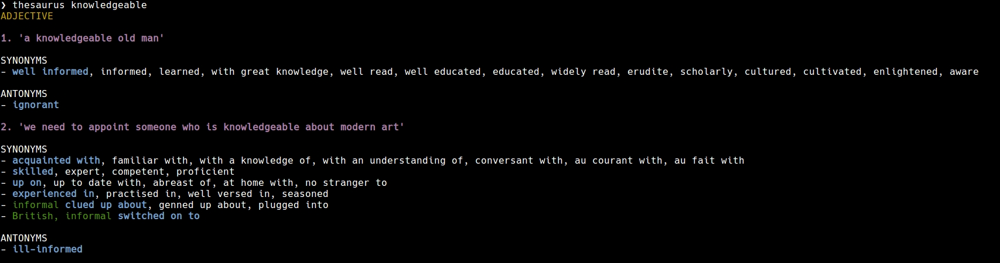

# thesaurus
[](https://circleci.com/gh/jakewarren/thesaurus)
[](https://github.com/jakewarren/thesaurus/releases])
[](https://godoc.org/github.com/jakewarren/thesaurus)
[](https://github.com/jakewarren/thesaurus/blob/master/LICENSE)
[](https://goreportcard.com/report/github.com/jakewarren/thesaurus)
[](http://makeapullrequest.com)

A command-line thesaurus app for Oxford.




## Installation

If you have a working Go environment, you can install via `go get`:
```shell
go get github.com/jakewarren/thesaurus/...
```

## Configuration

Uses the configuration scheme used by [Rican7/define](https://github.com/Rican7/define).

### Configuration file

A configuration file can be stored at `~/.define.conf.json` and **thesaurus** will automatically load the values specified there.

### Environment variables

Some configuration values can also be specified via environment variables. This is especially useful for API keys of different sources.

The following environment variables are read by **thesaurus**'s sources:

- `OXFORD_DICTIONARY_APP_ID`
- `OXFORD_DICTIONARY_APP_KEY`

## Acknowledgements

Very heavily based on:  
* [travis-g/dict](https://github.com/travis-g/dict)  
* [Rican7/define](https://github.com/Rican7/define)  


## Obtaining API keys

The following are links to register for API keys for the different sources:

- [Oxford Dictionaries API](https://developer.oxforddictionaries.com/?tag=#plans)
